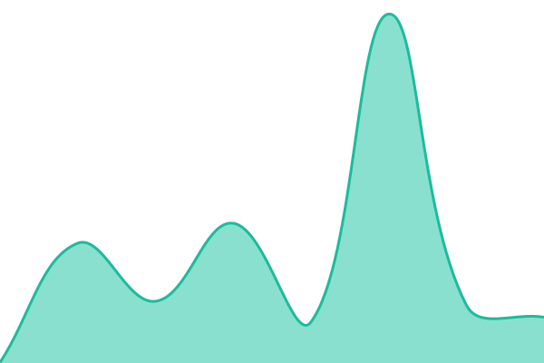
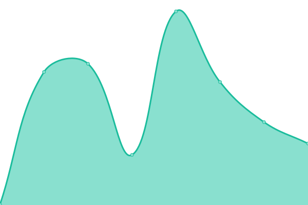
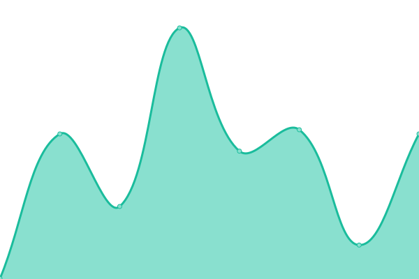

# [📈 Live Status](https://demo.upptime.js.org): <!--live status--> **🟩 All systems operational**

This repository contains the open-source uptime monitor and status page for [Upptime](https://upptime.js.org), powered by [Upptime](https://github.com/upptime/upptime).

With [Upptime](https://upptime.js.org), you can get your own unlimited and free uptime monitor and status page, powered entirely by a GitHub repository. We use [Issues](https://github.com/upptime/upptime/issues) as incident reports, [Actions](https://github.com/MOSA-Innovations/upptime_monitor/actions) as uptime monitors, and [Pages](https://demo.upptime.js.org) for the status page.

<!--start: status pages-->
<!-- This summary is generated by Upptime (https://github.com/upptime/upptime) -->
<!-- Do not edit this manually, your changes will be overwritten -->
<!-- prettier-ignore -->
| URL | Status | History | Response Time | Uptime |
| --- | ------ | ------- | ------------- | ------ |
|  [MOSA INNOVATIONS](https://www.mosainnovations.com/) | 🟩 Up | [mosa-innovations.yml](https://github.com/MOSA-Innovations/upptime_monitor/commits/HEAD/history/mosa-innovations.yml) | 

 220ms
     
 | 

<a href="https://MOSA-Innovations.github.io/upptime_monitor/history/mosa-innovations">100.00%</a>
    

|  [EVERY BIKE SECURE](https://www.everybikesecure.com/) | 🟩 Up | [every-bike-secure.yml](https://github.com/MOSA-Innovations/upptime_monitor/commits/HEAD/history/every-bike-secure.yml) | 

 286ms
     
 | 

<a href="https://MOSA-Innovations.github.io/upptime_monitor/history/every-bike-secure">100.00%</a>
    

|  [MOSA WORKS](https://www.workwithmosa.com/) | 🟩 Up | [mosa-works.yml](https://github.com/MOSA-Innovations/upptime_monitor/commits/HEAD/history/mosa-works.yml) | 

 260ms
     
 | 

<a href="https://MOSA-Innovations.github.io/upptime_monitor/history/mosa-works">100.00%</a>
    

|  [MOSA (old)](https://mosa.to) | 🟩 Up | [mosa-old.yml](https://github.com/MOSA-Innovations/upptime_monitor/commits/HEAD/history/mosa-old.yml) | 

 127ms
     
 | 

<a href="https://MOSA-Innovations.github.io/upptime_monitor/history/mosa-old">99.24%</a>
    

<!--end: status pages-->

[**Visit our status website →**](https://demo.upptime.js.org)

## 📄 License

- Powered by: [Upptime](https://github.com/upptime/upptime)
- Code: [MIT](./LICENSE) © [Anand Chowdhary](https://anandchowdhary.com), supported by [Pabio](https://pabio.com)
- Data in the `./history` directory: [Open Database License](https://opendatacommons.org/licenses/odbl/1-0/)
